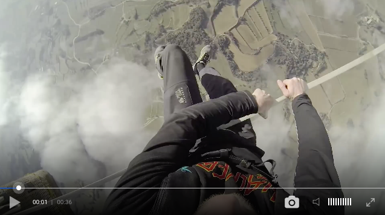

[](https://badge.fury.io/js/clappr-capture-plugin)
# Clappr Capture Plugin
A plugin for clappr which adds a button to capture a base64 jpeg image of the current frame. Emits an event with the base64 data which you can use elsewhere in your application (sending to a remote endpoint, etc)



# Usage
Add both Clappr and the capture plugin scripts to your HTML:

```html
<head>
  <script type="text/javascript" src="http://cdn.clappr.io/latest/clappr.min.js"></script>
  <script type="text/javascript" src="https://cdn.jsdelivr.net/npm/clappr-capture-plugin@latest/dist/clappr-capture-plugin.js"></script>
</head>
```

You can also find the project on npm: https://www.npmjs.com/package/clappr-capture-plugin

Then just add `ClapprCapturePlugin` into the list of plugins of your player instance.

```javascript
var player = new Clappr.Player({
  source: "http://your.video/here.mp4",
  plugins: [ClapprCapturePlugin]
});
```
That's it, a button will be shown on the media control to enable capture. This only works with playback tech's that use a `<video>` tag to display video

See the demo for how to capture the event.

# Demo
To run the demo start a web server with the root directory being the root of this repo, and then browse to the "index.html" file in the "demo" folder. The demo will open a new window with the captured image after the button has been clicked

# Development
Install dependencies:

`npm install`

Build:

`npm run build`

Minified version:

`npm run release`

Credit to Tom Jenkinson (@tjenkinson) for his PIP plugin, which this plugin used as a base template.